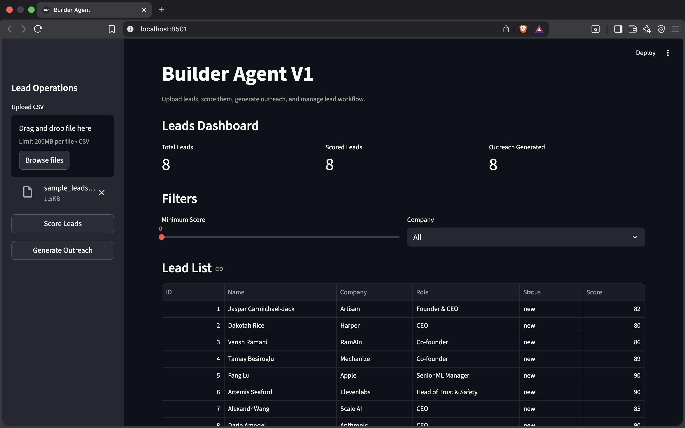
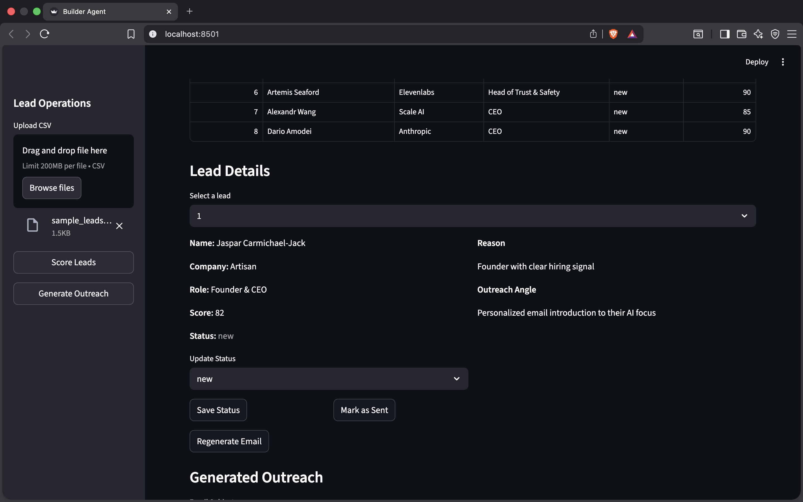
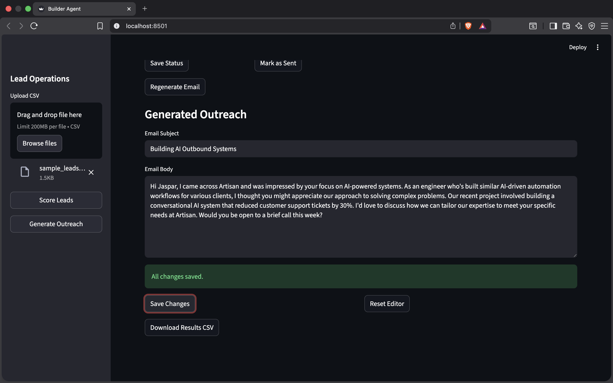
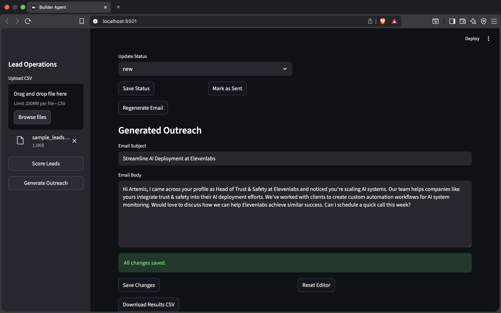

# Builder Agent

**AI-powered outbound workflow tool for turning leads into personalized outreach**

---

## What this is

Builder Agent is a lightweight internal tool that helps you go from:

raw leads → qualified targets → personalized outreach → tracked pipeline

in minutes.

It combines:

* lead ingestion
* LLM-based qualification
* personalized email generation
* workflow tracking

All in a simple UI.

---

## Why this exists

Most outbound workflows are:

* manual
* slow
* generic

This tool automates the **thinking + writing + tracking loop** while still letting you review and edit before sending.

---

## Core Features

### Lead Ingestion

* Upload CSV with leads
* Automatically stored in SQLite
* Duplicate-safe ingestion

---

### Lead Scoring (Local LLM)

* Uses **Ollama (llama3.2:3b)** locally
* Scores leads from 0–100
* Explains *why* a lead is valuable
* Generates an outreach angle

---

### Personalized Outreach

* Generates:

  * email subject
  * email body
* Tailored to:

  * role
  * company
  * hiring signals
* Designed to be short, specific, and human

---

### Per-Lead Regeneration

* Regenerate outreach for one lead
* No need to re-run everything

---

### Editable Emails

* Edit subject + email body
* Save changes to database
* Unsaved changes indicator
* Reset to last saved version

---

### Workflow Tracking

Each lead has a status:

* `new`
* `reviewed`
* `ready`
* `sent`

Includes:

* status editor
* “Mark as Sent” action
* visual status indicators

---

### Export

* Download results as CSV
* Includes:

  * score
  * reason
  * angle
  * subject
  * email

---

## Tech Stack

* **Frontend:** Streamlit
* **Backend:** Python
* **Database:** SQLite
* **LLM:** Ollama (local)
* **Model:** llama3.2:3b

---

## How it works

1. Upload a CSV of leads
2. Click **Score Leads**
3. Filter high-quality leads
4. Generate outreach
5. Edit and refine
6. Update status
7. Export or send

---

## Example Workflow

```text
Upload → Score → Filter → Generate → Edit → Mark Ready → Export
```

---

## Getting Started

### 1. Clone repo

```bash
git clone <https://github.com/Gowtham-Pentela/builder-agent.git>
cd builder-agent
```

---

### 2. Create virtual environment

```bash
python3 -m venv agent
source agent/bin/activate
```

---

### 3. Install dependencies

```bash
pip install -r requirements.txt
```

---

### 4. Install Ollama

Download from:
[https://ollama.com](https://ollama.com)

Then run:

```bash
ollama pull llama3.2:3b
```

---

### 5. Run the app

```bash
streamlit run app.py
```

Open:
[http://localhost:8501](http://localhost:8501)

---

## Sample CSV format

```csv
name,company,role,website,linkedin_url,hiring_signal,notes
Jaspar,Artisan,Founder,https://artisan.co,,Hiring builders for AI outbound systems,Posted about builder role
Dakotah Rice,Harper,CEO,https://harper.ai,,Hiring curious builders,YC founder hiring aggressively
```

---

## What makes this different

* Runs **fully local (no API cost)**
* Combines **decision + generation + workflow**
* Designed for **real usage**, not just demos
* Fast to iterate and extend

---

## Future Improvements

* Gmail / email sending integration
* Auto-follow-ups
* Lead scraping pipeline
* Multi-user support
* Better prompt tuning / few-shot examples

---

## Results






## Demo

(Insert Loom link here)

---

## Author

Built by [Gowtham](https://github.com/Gowtham-Pentela)

Focused on building AI-powered systems for real-world workflows.

